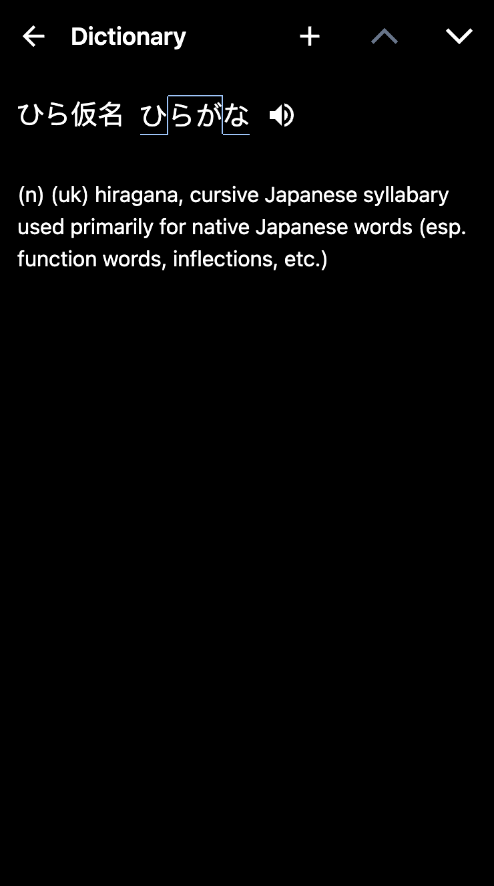
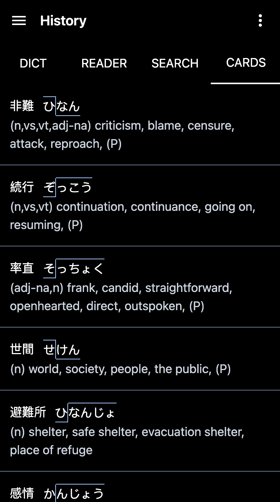

# Japanese Dictionary

A Japanese dictionary progressive web app written with [React](https://react.dev), [Next.js](https://nextjs.org), [TypeScript](https://typescriptlang.org), [TailwindCSS](https://tailwindcss.com), and [Zustand](https://github.com/pmndrs/zustand). Inspired by [Pleco](https://pleco.com). Initialized with [create-t3-app](https://create.t3.gg).

## Features

- Search Japanese text with kanji, hiragana, and romaji (for example: "漢字", "ひらがな", "ro-maji")
- Use clipboard reader to paste and read text, lookup words, and save flashcards
- Save dictionary lookup history, clipboard reader lookup history, search history, and flashcards
- Quiz yourself on saved flashcards by using flashcard tests
- Enable dark mode
- Installable on iOS, Android, Windows, Mac OS, and Linux
- Works entirely offline

## Screenshots

  
  
  
  
  
  
  
  
  
  
  
  
  
  
  
  

## Credits

- [Pleco](https://pleco.com) for design inspiration
- [JMdict/EDICT](https://www.edrdg.org/wiki/index.php/JMdict-EDICT_Dictionary_Project) for the word dictionary
- [Rikaikun](https://github.com/melink14/rikaikun) for the formatted word dictionary, word dictionary index, verb deconjugation code, and other pieces of code
- [Kanjium](https://github.com/mifunetoshiro/kanjium) for the pitch accent dictionary
